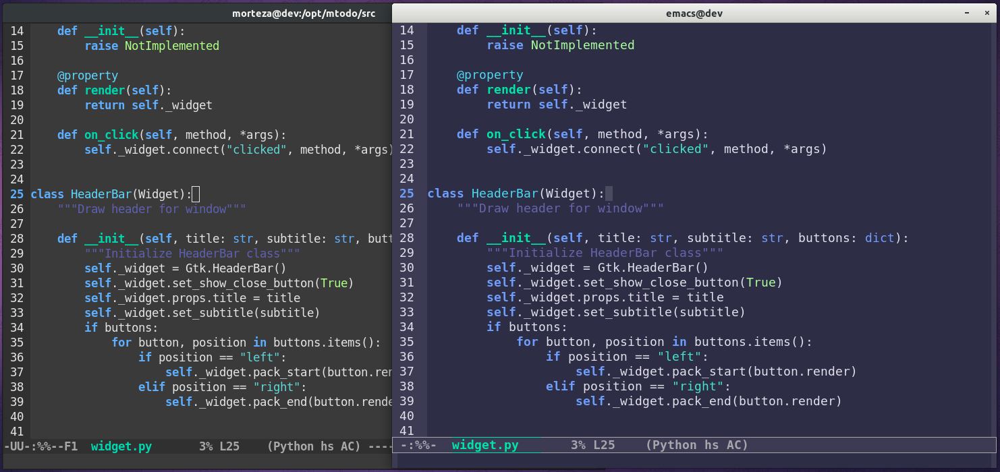

# Emacs LOP Theme
[LOP](https://github.com/mortezaipo/lop-theme) is the abbreviation of *Light On Party* sentence, is a new Emacs theme which inspired from [Atom Gloom](https://github.com/hejrobin/gloom) theme.



### Usage:

#### Install:

To install it in your system, try these steps:
```
$ mkdir -p ~/.emacs.d/themes
```

Then [**download**](https://github.com/mortezaipo/lop-theme/releases) the theme and put `lop-theme.el` file in the created directory.

Then introduce your theme directory to your emacs by adding this line in `~/.emacs` file:
```
(add-to-list 'custom-theme-load-path "~/.emacs.d/themes/")
```

Then set this theme as your default theme by adding this line in `~/.emacs` file:
```
(load-theme 'lop t)
```

#### Manual:

Loading Emacs theme is so easy:
```
load-file RET /path/to/lop-theme.el
```

### Troubleshoot:

LOP theme works fine on Emacs GUI software, but it's possible that this theme doesn't work well on Terminal environment, So until we handle/fix this issue completely, you could handle this situation by below code in your `~/.emacs`:
```lisp
(if (not window-system)
    (load-theme 'monokai t)
  (load-theme 'lop t))
```

When it find no window environment (like Terminal), it will load `monokai` theme (which works fine on Terminal environment), otherwise it will load `LOP` theme.

### How to Contribute:

Please **create issue on Github** to report bugs, send feature request and so on. Kindly create *pull request* when you've developed a good git commit.

### Acknowledgments:

* [Robin Grass](https://github.com/hejrobin) creator of [Gloom](https://github.com/hejrobin/gloom) theme for Atom.
* [Kelvin Smith](https://github.com/oneKelvinSmith) creator of [Monokai](https://github.com/oneKelvinSmith/monokai-emacs) theme for Emacs.
* [Martin Haesler](https://github.com/mswift42) creator of [emacs-theme-creator](https://github.com/mswift42/theme-creator).

### License:

LOP theme is under GNU General Public License Version 3 ([GNU GPLv3](https://www.gnu.org/licenses/gpl-3.0.en.html))

